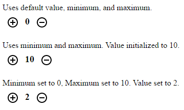

# Polymer Number Selector

There is no automated graded for this assignment.

### Objectives

1. Create a web component named `number-selector`. The final product should look like this:

    

2. The objective is simple: clicking the add button will increment the number and clicking minus button will decrement the number. If a maximum or minimum is set then the number cannot be incremented or decremented beyond those specified points.

3. An initial value can be set on the components `value` attribute. Defaults to `0`.

4. A maximum value can be set on the `maximum` attribute. Defaults to `NaN`.

5. A minimum value can be set on the `minimum` attribute. Defaults to `NaN`.

### Resources

- [Polymer Guide](https://www.polymer-project.org/1.0/docs/devguide/feature-overview)
- [Iron Icons](https://www.webcomponents.org/element/PolymerElements/iron-icons)
- [Paper Icon Button](https://www.webcomponents.org/element/PolymerElements/paper-icon-button)

### Instructions

1. Make sure that you have NodeJS, bower, and the polymer-cli installed on your computer.

2. Create a Github project for the assignment.

3. Clone the remote repository to your local computer.

4. Use `bower init` to initialize your bower dependencies.

5. Add the polymer paper-icon-button dependencies: `bower install --save PolymerElements/paper-icon-button PolymerElements/iron-icons`

4. Add the [index.html](./index.html) and [number-selector.html](./number-selector.html) files to your project.

5. Edit the `number-selector.html` file until you fulfill all of the objectives.

    1. Add paper-icon-buttons with + and - to increment or decement the value when clicked.

6. Use the polymer-cli or [http-server](https://www.npmjs.com/package/http-server) to run your server locally while you develop.
